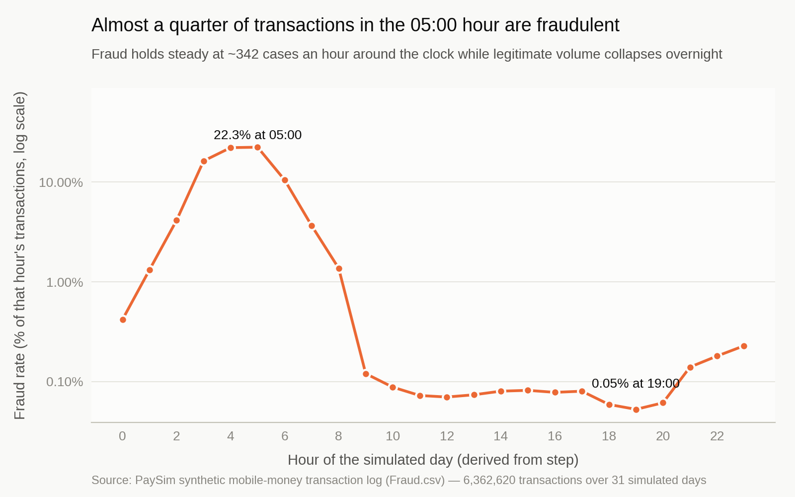
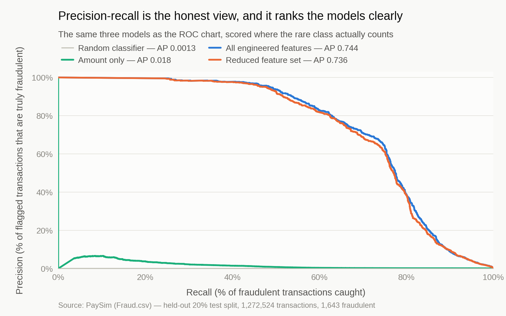
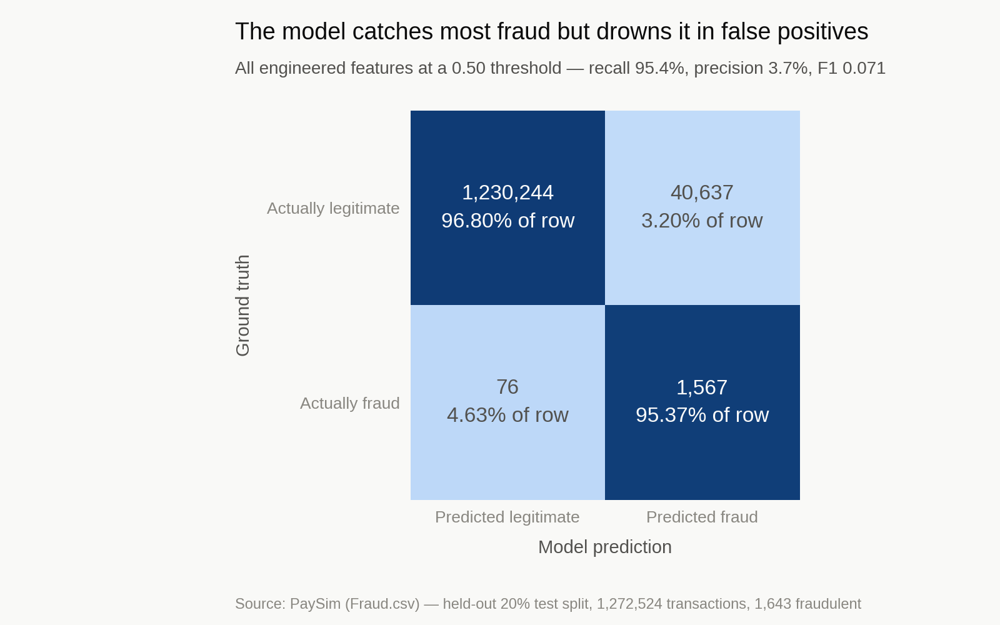
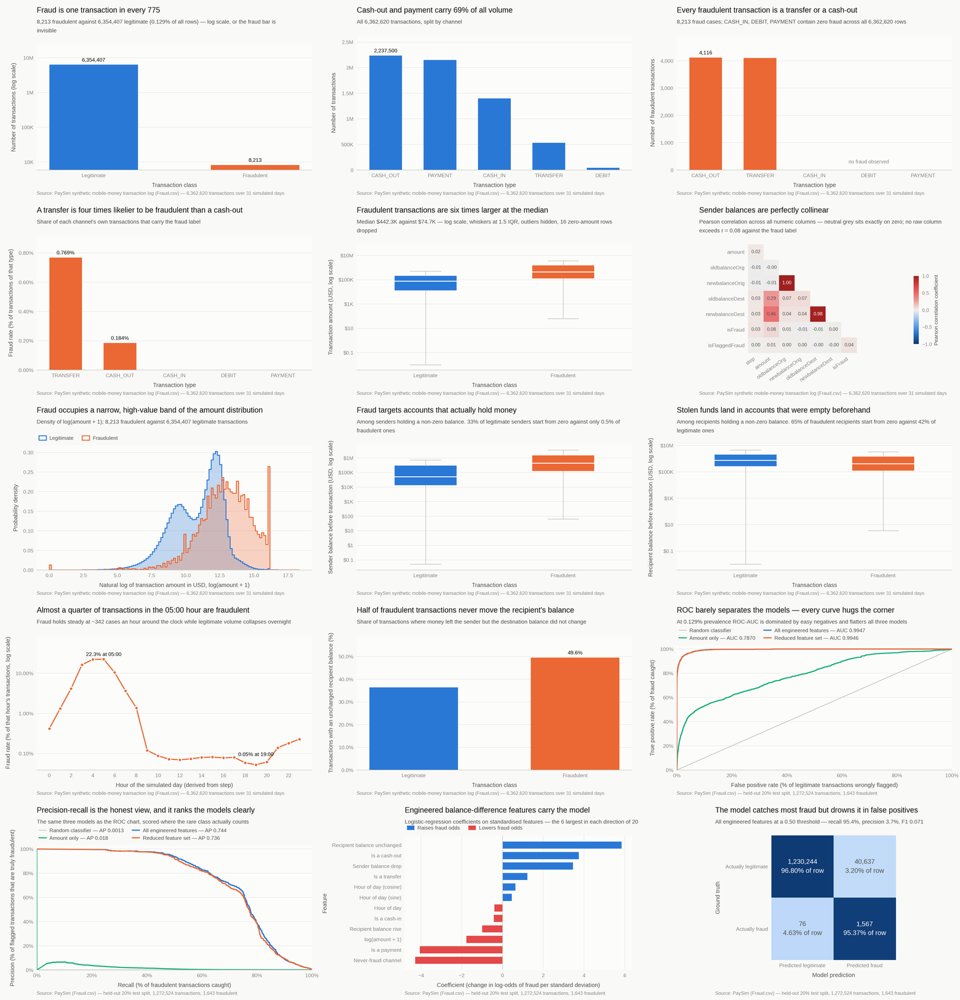

<h1 align="center">Fraud Detection on Mobile-Money Transactions</h1>

<p align="center">
  Finding 8,213 fraudulent transfers hidden in <b>6.36 million</b> PaySim mobile-money
  transactions — 1 row in 775 — at <b>0.744 average precision</b> and <b>95.4% recall</b>,<br>
  and showing why the 0.995 ROC-AUC everyone reports for this dataset is the wrong number.
</p>

<p align="center">
  
  
  
  
  
  
  
  <a href="LICENSE"></a>
  <br>
  <a href="https://www.kaggle.com/datasets/ealaxi/paysim1"></a>
  <br>
  <a href="https://vishnujan-narayanan.vercel.app/"></a>
  <a href="https://github.com/VishnujanNarayanan"></a>
  <a href="https://www.linkedin.com/in/vishnujan-narayanan"></a>
  <a href="https://substack.com/@vishnujannarayanan"></a>
</p>

<p align="center">
  📊 <a href="#results">Results</a> ·
  🗃️ <a href="#dataset">Dataset</a> ·
  🧩 <a href="#approach">Approach</a> ·
  ⚡ <a href="#installation-and-usage">Installation</a> ·
  🖼️ <a href="#figures">Figures</a> ·
  🎨 <a href="#figure-style">Figure Style</a> ·
  🔍 <a href="#findings">Findings</a>
</p>

---

One notebook, top to bottom in ~70 seconds: EDA on all 6.36M rows, a hand-built
`FraudPreprocessor` transformer, three logistic-regression variants, and 15 figures that all
route through a single shared style module.

## Results

| Model | ROC-AUC | Avg precision | Precision | Recall | F1 |
| --- | --- | --- | --- | --- | --- |
| Amount only (baseline) | 0.7870 | 0.0184 | 0.0027 | 0.7243 | 0.0054 |
| **All engineered features** | **0.9947** | **0.7440** | 0.0371 | 0.9537 | 0.0715 |
| Reduced feature set | 0.9946 | 0.7355 | 0.0361 | 0.9556 | 0.0696 |

Logistic regression with `class_weight="balanced"`, scored on a held-out 20% split —
1,272,524 transactions, 1,643 of them fraudulent.

<p align="center">
  
</p>
<p align="center"><i>The strongest signal in the dataset. Fraud runs at a near-constant ~342 cases an hour while legitimate volume collapses overnight — a 422× swing in fraud rate between 05:00 (22.3%) and 19:00 (0.053%).</i></p>

<p align="center">
  
</p>
<p align="center"><i>Precision-recall separates the three models; ROC does not. Average precision falls from 0.744 to 0.018 against 0.0013 for a random classifier.</i></p>

<p align="center">
  
</p>
<p align="center"><i>The price of 95.4% recall at the default threshold: 40,637 false positives, so only 1 alert in 27 is real.</i></p>

## Dataset

**PaySim** — an agent-based simulation of mobile-money transactions, calibrated on logs from a
real African mobile-money service, published as
[Synthetic Financial Datasets For Fraud Detection](https://www.kaggle.com/datasets/ealaxi/paysim1)
(Lopez-Rojas et al.).

| | |
| --- | --- |
| Shape | 6,362,620 rows × 11 columns (471 MB) |
| Period | 743 hourly steps ≈ 31 simulated days |
| Target | `isFraud` — 8,213 positives (0.129%) |
| Channels | CASH_OUT, PAYMENT, CASH_IN, TRANSFER, DEBIT |
| Missing values | none |
| Split | 5,090,096 train / 1,272,524 test, stratified, `random_state=42` |
| Licence | CC BY-SA 4.0 |

### Getting the data

`Fraud.csv` is **not in this repo** — at 471 MB it is gitignored. Download it from Kaggle
(~186 MB zipped) and unzip it into the repository root:

```bash
# Option 1 — Kaggle CLI (needs ~/.kaggle/kaggle.json)
pip install kaggle
kaggle datasets download -d ealaxi/paysim1 --unzip -p .

# Option 2 — download by hand from
# https://www.kaggle.com/datasets/ealaxi/paysim1
# then unzip so that Fraud.csv sits next to Fraud_Detection_Model.ipynb
```

The archive contains a single CSV. If it unzips under a different name, rename it to
`Fraud.csv` — that is the filename the notebook expects. Column definitions are in
[`Data Dictionary.txt`](Data%20Dictionary.txt).

The simulator behind the data is described in Lopez-Rojas, Elmir & Axelsson,
*"PaySim: A financial mobile money simulator for fraud detection"*, 28th European Modeling
and Simulation Symposium (EMSS), 2016.

## Approach

1. **Load.** Read with the `pyarrow` engine, dropping `nameOrig` and `nameDest` at parse time —
   two identifier columns with ~6.3M distinct values each. Takes the 471 MB read from ~30s to
   under 2s.
2. **Explore.** 11 figures across class imbalance, channel mix, amount and balance
   distributions by class, correlation structure, hour-of-day fraud rate and the
   balance-update signature. Chi-square (channel vs fraud) and Mann–Whitney U (amount) both
   return p below floating-point resolution.
3. **Engineer.** `FraudPreprocessor` (in `fraud_features.py`) builds `diff_orig` / `diff_dest` (balance movements),
   `suspicious_flag` (money left the sender but the recipient balance never moved), cyclical
   hour encodings, one-hot channel dummies and `log_amount`. `newbalanceOrig` is dropped for
   perfect collinearity with `oldbalanceOrg` (r = 1.00); both destination balances are kept
   (r = 0.98, and the gap between them is itself the signal).
4. **Model.** Three logistic-regression variants — an amount-only baseline to show what one
   feature buys you, the full engineered set, and a reduced set with the weak and constant
   features removed. Design matrices are cast to `float32` so the 5.09M-row fit stays inside
   7 GB of RAM.
5. **Evaluate.** ROC and precision-recall curves, standardised coefficients, and a confusion
   matrix at the 0.50 threshold.

## Installation and usage

```bash
git clone https://github.com/VishnujanNarayanan/fraud_detection.git
cd fraud_detection

python3 -m venv .venv
source .venv/bin/activate        # Windows: .venv\Scripts\activate

pip install -r requirements.txt
```

Place `Fraud.csv` in the repository root — see
[Getting the data](#getting-the-data) — then run the analysis end to end and regenerate every
figure in `figures/`:

```bash
jupyter nbconvert --to notebook --execute --inplace Fraud_Detection_Model.ipynb
```

Or open it interactively:

```bash
jupyter lab Fraud_Detection_Model.ipynb
```

### SQL aggregations

The exploratory aggregations also exist as SQL, so the notebook, the spreadsheet report
and the dashboard all read one definition of each number instead of recomputing it three
times and drifting apart:

```bash
python load_sqlite.py            # build fraud.db, run sql/aggregations.sql, write app_data/
python load_sqlite.py --skip-build   # re-run the queries against an existing database
```

### Spreadsheet report

The same aggregates, as a workbook someone in a risk or finance team can open without
Python:

```bash
python make_report.py            # reads app_data/, writes reports/fraud_summary.xlsx
```

Six sheets — channel mix, fraud by hour (with a line chart), amount by class, the
balance signature, the built-in rule's effectiveness, and a **pivot of fraud rate by
channel and hour**. Each sheet carries a plain-English caption, a frozen filtered header
and sized columns. `reports/` is gitignored — regenerate it from the CSVs.

The pivot is where the sharpest finding shows up: **70.7% of transfers made in the 05:00
hour are fraudulent**, against 2.4% at midnight.

`sql/schema.sql` defines the `transactions` table and its indexes; `sql/aggregations.sql`
holds five named queries — channel mix, fraud rate by hour, amount by class, the
balance-update signature, and how much the dataset's own fraud rule actually catches.
Results are written to `app_data/*.csv`, which is what the dashboard reads.

The load takes about 30 seconds and reads the CSV in chunks, so it stays well under a
gigabyte of memory. `fraud.db` is gitignored — it is a build artefact, not a source file.

Requires Python 3.10+ and about 4 GB of free RAM. A full run takes roughly 70 seconds.

## Tests and CI

```bash
pip install -r requirements-dev.txt
ruff check .          # lint
pytest                # 23 tests, ~1 second
```

Every test is synthetic: the transformer is exercised on a ten-row frame covering all
five channels, and the SQL runs against an in-memory SQLite database built from the real
`sql/schema.sql`. Nothing depends on the 471 MB download, so CI runs on a clean checkout.

These are the checks CI runs on every push and pull request.

## Figures

Fifteen figures, all written by the notebook to [`figures/`](figures/) at 1600×1000. They share
a single style module, so they read as one set.

<p align="center">
  
</p>

| Figure | Shows |
| --- | --- |
| [`01-class-imbalance`](figures/01-class-imbalance.png) | 8,213 fraud against 6.35M legitimate, log scale |
| [`02-transaction-type-mix`](figures/02-transaction-type-mix.png) | Volume by channel |
| [`03-fraud-count-by-type`](figures/03-fraud-count-by-type.png) | Fraud is exclusive to TRANSFER and CASH_OUT |
| [`04-fraud-rate-by-type`](figures/04-fraud-rate-by-type.png) | Fraud rate within each channel |
| [`05-amount-by-class`](figures/05-amount-by-class.png) | Amount by class, log scale |
| [`06-correlation-heatmap`](figures/06-correlation-heatmap.png) | Correlation structure, zero-centred diverging |
| [`07-amount-distribution-log`](figures/07-amount-distribution-log.png) | Amount density by class |
| [`08-origin-balance-by-class`](figures/08-origin-balance-by-class.png) | Sender balance before the transaction |
| [`09-destination-balance-by-class`](figures/09-destination-balance-by-class.png) | Recipient balance before the transaction |
| [`10-fraud-rate-by-hour`](figures/10-fraud-rate-by-hour.png) | Fraud rate by hour of day |
| [`11-balance-error-signature`](figures/11-balance-error-signature.png) | Unchanged recipient balances by class |
| [`12-roc-curves`](figures/12-roc-curves.png) | ROC for all three models |
| [`13-precision-recall-curves`](figures/13-precision-recall-curves.png) | Precision-recall for all three models |
| [`14-model-coefficients`](figures/14-model-coefficients.png) | Standardised coefficients by sign |
| [`15-confusion-matrix`](figures/15-confusion-matrix.png) | Confusion matrix at the 0.50 threshold |

## Figure style

Every chart routes through [`viz_style.py`](viz_style.py), which owns the rcParams, the palette
and the layout geometry. The notebook never sets a colour, a grid or a font:

```python
import viz_style as vs

vs.apply()

fig, ax = vs.figure()                          # 8x5in at 200dpi
ax.bar(labels, values, color=vs.BLUE)
vs.finish(
    fig, ax,
    title="What the chart shows",
    subtitle="Sample size and caveats",
    xlabel="Transaction class",
    ylabel="Fraud rate (% of transactions of that type)",
    source="Source: PaySim synthetic mobile-money transaction log",
)
vs.save(fig, "04-fraud-rate-by-type")          # figures/…png at exactly 1600x1000
```

Margins are fixed rather than tight-cropped, so every PNG comes out the same pixel size. The
module also exposes a fixed categorical palette, a single-hue sequential ramp, a zero-centred
diverging norm, and tick formatters for thousands separators, compact currency and percentages.
Fraud is orange and legitimate is blue in every chart, so the reader learns it once.

## Project structure

```
fraud_detection/
├── Fraud_Detection_Model.ipynb   # The project: EDA → features → 3 models → 15 figures
├── viz_style.py                  # Shared figure style — palette, type scale, layout, save path
├── fraud_features.py             # FraudPreprocessor — the feature-engineering transformer
├── tests/                        # 23 tests over the transformer and the SQL, no dataset needed
├── load_sqlite.py                # Loads the CSV into SQLite and runs the aggregations
├── make_report.py                # Builds the Excel workbook from the aggregates
├── sql/
│   ├── schema.sql                # transactions table + indexes
│   └── aggregations.sql          # Five named queries behind the findings
├── app_data/                     # Query results as small CSVs — the report's input
├── reports/                      # Generated fraud_summary.xlsx (gitignored)
├── figures/                      # Generated PNGs, 1600x1000, overwritten on each run
│   ├── 00-contact-sheet.png
│   └── 01-…-15-….png
├── Data Dictionary.txt           # Column definitions from the dataset authors
├── requirements.txt
├── LICENSE
└── README.md
```

`Fraud.csv`, `fraud.db` and `fraud_preprocessor.pkl` are gitignored — one is downloaded, the
others are generated.

## Findings

- **Fraud is exclusive to two channels, not merely concentrated in them.** All 8,213 cases are
  `TRANSFER` (0.769% of transfers) or `CASH_OUT` (0.184%). `PAYMENT`, `DEBIT` and `CASH_IN`
  contain zero fraud across 3.6M rows, so three of the five channels can be discarded before
  any model is fitted.
- **Time of day beats every raw column.** Fraud volume is flat at ~342 cases an hour around the
  clock while legitimate traffic swings 500× (1,241 transactions at 04:00 against 647,814 at
  19:00). That asymmetry alone drives the fraud rate from 0.053% to 22.3% — and no raw column
  exposes it; it has to be derived from `step`.
- **The most useful engineered feature is an accounting impossibility.** In 49.6% of fraudulent
  transactions money leaves the sender but the recipient's balance never changes, against 36.4%
  of legitimate ones. It carries the largest positive coefficient in the model.
- **ROC-AUC is the wrong metric here, and it hides a 40× gap.** The amount-only baseline scores
  a respectable-looking 0.787 ROC-AUC but only 0.018 average precision — barely distinguishable
  from random once the 1.27M easy negatives stop counting. Reporting ROC-AUC alone on this
  dataset makes a near-useless model look defensible.
- **Two engineered features are provably dead.** `error_flag` is identically 0 — PaySim contains
  no negative balances at all — and its fitted coefficient is exactly 0.000.
  `always_nonfraud_type` is an exact linear combination of the three never-fraud channel
  dummies. Dropping both costs almost nothing (AP 0.7440 → 0.7355).
- **The dataset's own fraud rule catches almost nothing.** `isFlaggedFraud` fires on 16
  transactions. All 16 are genuine fraud — but that is 0.19% of the 8,213 cases present.

## Author

<p align="center">
  <strong>Vishnujan Narayanan</strong>
</p>

<p align="center">
  <a href="https://vishnujan-narayanan.vercel.app/"></a>
  <a href="https://github.com/VishnujanNarayanan"></a>
  <a href="https://www.linkedin.com/in/vishnujan-narayanan"></a>
  <a href="https://substack.com/@vishnujannarayanan"></a>
</p>

## Licence

Released under the MIT Licence — see [LICENSE](LICENSE). The PaySim dataset is separately
licensed CC BY-SA 4.0 by its authors.
